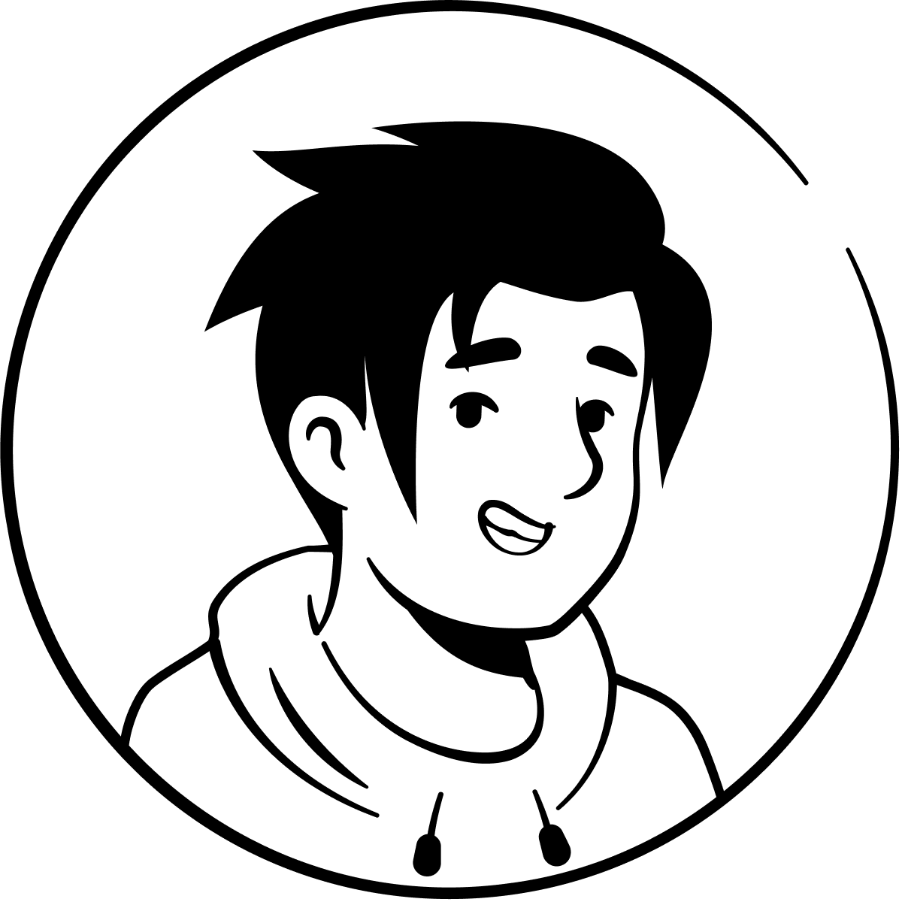

# Portafolio de Daniel

    

¡Bienvenido a mi portafolio! Mi nombre es Daniel, tengo 16 años y soy de Cali, Colombia. Actualmente me encuentro en proceso de completar mis estudios como ingeniero de software y en este repositorio podrás ver algunos de los proyectos en los que he trabajado, así como la tecnología que he utilizado para construirlos.

## Sobre mí

Soy un aprendiz autodidacta apasionado por brindar la mejor experiencia al usuario en cada proyecto en el que me involucro. Me encanta colaborar con otros y liderar cuando se presenta la oportunidad, ya que creo en el poder del trabajo en equipo para alcanzar objetivos comunes.

A lo largo de mi trayectoria, he superado diversos desafíos a través de pruebas técnicas y proyectos con diferentes tecnologías. Mi enfoque principal es aprender y mejorar continuamente para crear soluciones innovadoras y efectivas.

## Proyectos

### Todo List Contexto

**Tecnologías:** TailwindCSS, React, Node.js, MongoDB, TypeScript, Zustand
Este proyecto es un Todo List que construí utilizando un stack full-stack que incluye TailwindCSS para el diseño, React para el frontend, Node.js para el backend y MongoDB como base de datos NoSQL. Aprendí mucho sobre la integración de tecnologías frontend y backend, la gestión eficiente de estados y el trabajo con bases de datos NoSQL, lo cual ha fortalecido mis habilidades en desarrollo full-stack.

### Fall of the Gods

**Tecnologías:** GDScript, TailwindCSS, React
Este es un juego de aventuras inspirado en la mitología griega que desarrollé utilizando GDScript para la lógica del juego y TailwindCSS y React para la interfaz web. En "Fall of the Gods", exploras roles mitológicos en un mundo de arte pixelado en 2D. Este proyecto me permitió desarrollar habilidades tanto en diseño de juegos como en la creación de interfaces web.

## Tecnologías y Herramientas

- **Frontend:** Astro, TailwindCSS, React

- **Backend:** Node.js, MongoDB

- **Otros:** GDScript, TypeScript, Zustand

## Conéctate conmigo

- **GitHub:** [contexto01](https://www.github.com/contexto01)

- **LinkedIn:** [Daniel Steve Barrera Polo](https://www.linkedin.com/in/daniel-steve-barrera-polo-39b93a271)

Gracias por visitar mi portafolio. ¡Espero que encuentres algo de valor en mis proyectos y aprendizajes!

---
